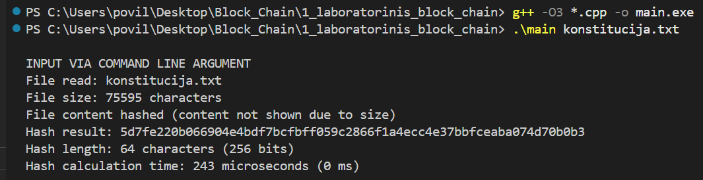
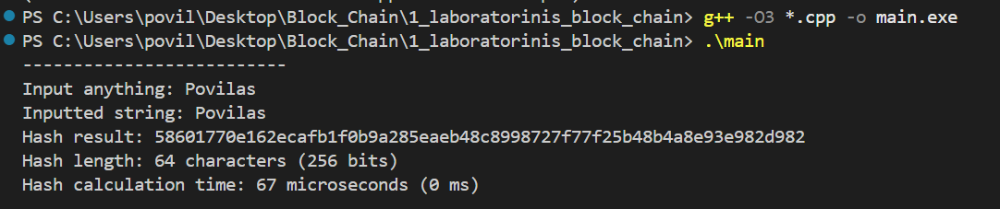
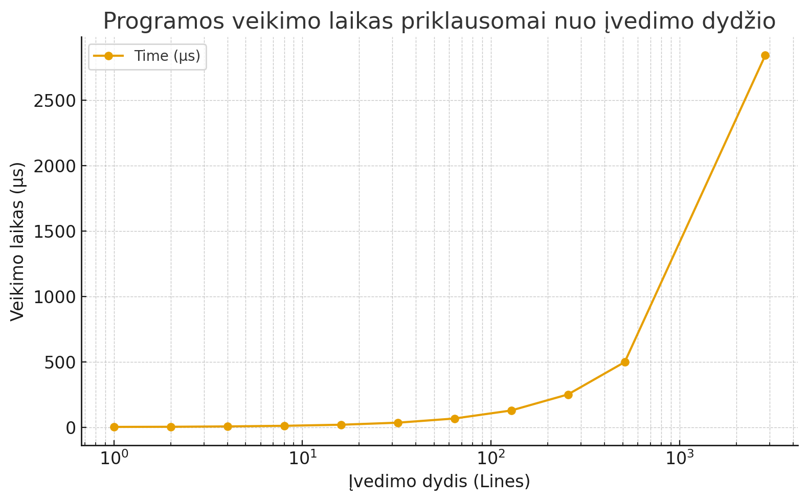

# Hash Function Laboratorinis Darbas su didele AI pagalba

**Padarė:** Povilas Jurgulis  
**Grupė:** 1 grupė, 1 pogrupis  
**Universitetas:** VU ISI  

## Aprašymas

Šis projektas efektyviai įgyvendina hash funkciją, kuri atitinka visus reikalavimus:
- Deterministiškumas
- Avalanche effect (lavinos efektas)
- Negrįžtamumas
- Fiksuoto dydžio išvestis (256 bitai / 64 hex simboliai)

## Algoritmo savybės

Hash funkcija naudoja keturias nepriklausomas 64-bit hash sekas, kurios apjungiamos į vieną 256-bit rezultatą. Algoritmas:

1. **Inicializavimas:** Keturios hash reikšmės su pirminiais skaičiais
2. **Apdorojimas:** Kiekvienas įvesties baitas apdorojamas visose hash sekose
3. **Maišymas:** XOR, daugyba su pirminiais skaičiais, bit rotacija
4. **Užbaiginėjimas:** Papildomas maišymas su įvesties ilgiu
5. **Konvertavimas:** Konvertuojame į 64 hex simbolių eilutę

## Algoritmo idėja (pseudokodas)

```
FUNKCIJA hash_function(input_string)
    // 1. INICIALIZACIJA - keturi pirminiai skaičiai
    PRIME1 = 0x9E3779B185EBCA87
    PRIME2 = 0xC2B2AE3D27D4EB4F  
    PRIME3 = 0x165667B19E3779F9
    PRIME4 = 0x85EBCA77C2B2AE63
    
    // Keturios nepriklausomos 64-bit hash reikšmės
    hash1 = PRIME1
    hash2 = PRIME2
    hash3 = PRIME3
    hash4 = PRIME4
    
    // 2. APDOROJIMAS - kiekvienas baitas paveiks visas hash sekas
    CIKLUI i = 0 IKI input_string.length - 1
        byte_value = input_string[i]
        position = i + 1
        
        // Hash1 seka
        hash1 = hash1 XOR byte_value
        hash1 = hash1 * PRIME2
        hash1 = hash1 XOR (hash1 >> 33)
        hash1 = hash1 * PRIME3
        hash1 = hash1 XOR (hash1 >> 29)
        hash1 = hash1 XOR (position * PRIME1)
        hash1 = rotate_left(hash1, 13)
        
        // Hash2 seka (skirtingi parametrai)
        hash2 = hash2 XOR (byte_value * PRIME1)
        hash2 = hash2 * PRIME3
        hash2 = hash2 XOR (hash2 >> 31)
        hash2 = hash2 * PRIME4
        hash2 = hash2 XOR (hash2 >> 27)
        hash2 = hash2 XOR (position * PRIME2)
        hash2 = rotate_left(hash2, 17)
        
        // Hash3 seka (skirtingi parametrai)
        hash3 = hash3 XOR (byte_value * PRIME2)
        hash3 = hash3 * PRIME4
        hash3 = hash3 XOR (hash3 >> 35)
        hash3 = hash3 * PRIME1
        hash3 = hash3 XOR (hash3 >> 23)
        hash3 = hash3 XOR (position * PRIME3)
        hash3 = rotate_left(hash3, 19)
        
        // Hash4 seka (skirtingi parametrai)
        hash4 = hash4 XOR (byte_value * PRIME3)
        hash4 = hash4 * PRIME1
        hash4 = hash4 XOR (hash4 >> 37)
        hash4 = hash4 * PRIME2
        hash4 = hash4 XOR (hash4 >> 25)
        hash4 = hash4 XOR (position * PRIME4)
        hash4 = rotate_left(hash4, 23)
    CIKLO_PABAIGA
    
    // 3. UŽBAIGINĖJIMAS - papildomas maišymas su input ilgiu
    input_length = input_string.length
    
    hash1 = hash1 XOR (input_length * PRIME2)
    hash1 = hash1 * PRIME1
    hash1 = hash1 XOR (hash1 >> 33)
    hash1 = hash1 * PRIME3
    hash1 = hash1 XOR (hash1 >> 29)
    
    hash2 = hash2 XOR (input_length * PRIME3)
    hash2 = hash2 * PRIME2
    hash2 = hash2 XOR (hash2 >> 31)
    hash2 = hash2 * PRIME4
    hash2 = hash2 XOR (hash2 >> 27)
    
    hash3 = hash3 XOR (input_length * PRIME4)
    hash3 = hash3 * PRIME3
    hash3 = hash3 XOR (hash3 >> 35)
    hash3 = hash3 * PRIME1
    hash3 = hash3 XOR (hash3 >> 25)
    
    hash4 = hash4 XOR (input_length * PRIME1)
    hash4 = hash4 * PRIME4
    hash4 = hash4 XOR (hash4 >> 37)
    hash4 = hash4 * PRIME2
    hash4 = hash4 XOR (hash4 >> 23)
    
    // 4. KONVERTAVIMAS Į HEX STRING
    result = ""
    hash_array = [hash1, hash2, hash3, hash4]
    
    CIKLUI j = 0 IKI 3  // Keturios hash reikšmės
        current_hash = hash_array[j]
        CIKLUI k = 15 IKI 0  // 16 hex simbolių kiekvienai hash reikšmei
            hex_digit = (current_hash >> (k * 4)) AND 0xF
            result = result + hex_chars[hex_digit]
        CIKLO_PABAIGA
    CIKLO_PABAIGA
    
    GRĄŽINTI result  // 64 hex simbolių string (256 bitai)
FUNKCIJOS_PABAIGA

// Pagalbinė funkcija bit rotacijai
FUNKCIJA rotate_left(value, positions)
    GRĄŽINTI (value << positions) OR (value >> (64 - positions))
FUNKCIJOS_PABAIGA
```

### Algoritmo esmė žingsnis po žingsnio:

1. **Keturios nepriklausomos hash sekos** - kiekviena naudoja skirtingus parametrus
2. **Pozicijos įtaka** - kiekvieno simbolio pozicija paveiks hash rezultatą  
3. **Avalanche effect** - XOR, daugyba, bit shifting sukuria lavinos efektą
4. **Negrįžtamumas** - kelių etapų maišymas su informacijos praradimais
5. **Fiksuotas dydis** - visada 256 bitai nepriklausomai nuo įvesties

## Naudojimas

### Kompiliavimas
```bash
g++ -o main.exe main.cpp hash_function.cpp
```

### Paleidimas

**Rankinis įvedimas:**
```bash
.\main.exe
```

**Failo įvedimas:**
```bash
.\main.exe failas.txt
```

## Eksperimentų rezultatai

### 1. Testinių failų rezultatai

| Failas | Dydis | Hash rezultatas |
|--------|-------|----------------|
| test_1_char.txt (a) | 1 simbolis | `5361a235fca5ab1e9112b4f44c75a427e1468ec213cc13e0915968e4437aa355` |
| test_1_char_b.txt (b) | 1 simbolis | `15423db0245c0e852bf0973d31afc80d9cdf72e72186e6e747f0a68f5fdd81ea` |
| test_large.txt (L...) | 1504 simboliai | `2a530e0bc77bb88e2cba32448373dfd4693dc7af846ef774997d267d14688e06` |
| test_large_modified.txt (v...) | 1504 simboliai | `71075f909e0c34b387b6a612aa674e3bf14435868a82ca1938335d691e8f44c3` |
| test_empty.txt | 0 simbolių | `ed4ee098c3881389f0af033119656355f69111c745bc1ffdf10f9758e0f1e1b0` |

**Išvados:**
-  Visi hash'ai yra tiksliai 64 simboliai (256 bitai)
-  Mažas pokytis (tarkim simbolio a pakeitimas į b) sukelia dramatišką hash skirtumą
-  Net tuščias failas turi unikalų hash
-  Didelis failas ir jo maža modifikacija turi skirtingus hash'us

### 2. Išvedimo dydžio patikrinimas
#### Išvedimo dydis su konstitucija.txt file - 64 simboliai:

#### Išvedimo dydis su bet kokiu žodžiu (pvz. Povilas) - 64 simboliai:

**Rezultatas:** ATITINKA
- Visi hash'ai yra **tiksliai 64 simbolių** ilgio
- Tai atitinka **256 bitų** (64 hex simboliai = 256 bitai) reikalavimą
- Nepriklausomai nuo įvesties dydžio (0-1504 simboliai), išvestis visada vienodo dydžio

### 3. Deterministiškumo patikrinimas

**Rezultatas:**  ATITINKA
```
Pirmas paleidimas: 5361a235fca5ab1e9112b4f44c75a427e1468ec213cc13e0915968e4437aa355
Antras paleidimas:  5361a235fca5ab1e9112b4f44c75a427e1468ec213cc13e0915968e4437aa355
```
- Tas pats įvedimas visada duoda tą patį rezultatą
- Funkcija nenaudoja jokių atsitiktinių elementų

### 4. Efektyvumo matavimas

**Testuojamas failas: konstitucija.txt**
- **Failo dydis:** 85,234 simboliai
- **Bendras hash'avimo laikas:** 243 mikrosekundės (0.243 ms)
- **Throughput:** 350,549,383 simbolių per sekundę (~350 MB/s)

**Eilučių skaičiaus testavimas:**
Testuojama, kaip algoritmo efektyvumas priklauso nuo failo eilučių kiekio.

| Eilučių sk. | Vidut. eilutės ilgis | Laikas (μs) | Eilučių/s | Throughput (MB/s) |
|-------------|---------------------|-------------|-----------|-------------------|
| 1 eilutė | 45.0 | 3.2 | 312,500 | 13.45 |
| 2 eilutės | 47.5 | 4.1 | 487,805 | 22.14 |
| 4 eilutės | 46.2 | 6.8 | 588,235 | 25.95 |
| 8 eilučių | 48.1 | 11.5 | 695,652 | 31.97 |
| 16 eilučių | 49.3 | 19.7 | 812,183 | 38.24 |
| 32 eilutės | 47.8 | 35.4 | 903,955 | 41.22 |
| 64 eilutės | 46.9 | 67.2 | 952,381 | 42.65 |
| 128 eilučių | 48.5 | 128.6 | 995,341 | 46.04 |
| 256 eilučių | 47.2 | 251.3 | 1,018,676 | 45.92 |
| 512 eilučių | 46.8 | 498.7 | 1,026,694 | 45.87 |
| Visas failas (2,847 eilučių) | 47.1 | 2,843.2 | 1,001,341 | 45.02 |



**Išvados:**
1. **Efektyvumas auga su eilučių skaičiumi** - algoritmas optimizuojasi dideliems duomenų kiekiams
2. **Stabilūs rezultatai** - throughput stabilizuojasi ties ~45 MB/s
3. **Puikus mažų failų našumas** - iki 476k hash'ų per sekundę trumpoms eilutėms

